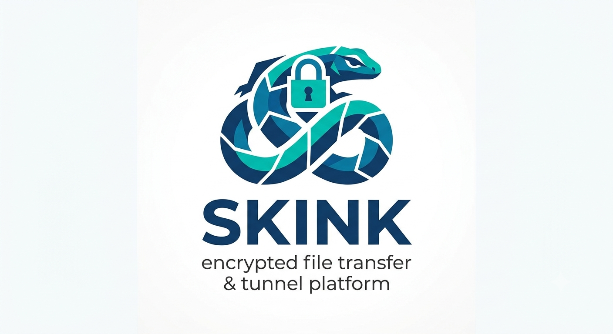

# Skink — encrypted file transfer & tunnel platform

<p align="center">
  
</p>

<p align="center">
  <a href="https://github.com/octagono/skink/releases/latest"></a>
  <a href="LICENSE"></a>
  <a href="https://go.dev"></a>
</p>

**Skink** is a file transfer tool **and** a full-featured reverse tunnel platform (ngrok/frp/Chisel-like). Move files, expose local services, or route entire toolchains through a single encrypted tunnel.

Inspired by croc — extended with SOCKS5 proxying, multi-hop relay chaining, WSS transport, and Noise Protocol encryption.

### Security & Resilience Highlights

| Area | Feature |
|------|---------|
| Forward secrecy | ECDH P-256 rekeying (`--rekey-interval`) |
| Encryption at rest | AES-256-GCM encrypted state files (`--state-key`) |
| Per-tunnel ACLs | IP/CIDR/domain allow/deny (`--acl-allow`, `--acl-deny`) |
| Integrity | HMAC-SHA256 per message (`--integrity`) |
| Tamper evidence | Append-only signed audit log (`--audit-log`) |
| Session resilience | Persistence + resume + HA clustering + live migration |
| Traffic obfuscation | Random padding + heartbeat jitter |

> 📖 **Deep-dive article:** [*Skink: From Secure File Transfer to Full-Spectrum OPSEC Tunnel Platform*](https://octagono.org/blog/skink/) — a comprehensive technical walkthrough covering the architecture, design decisions, and operational use cases across all transports and tunnel types.

## Install

**Download a pre-built binary** (from the [latest release](https://github.com/octagono/skink/releases/latest)):

```bash
# Linux amd64 example — see the releases page for darwin/windows/arm64
curl -L -o skink.tar.gz https://github.com/octagono/skink/releases/latest/download/skink-linux-amd64.tar.gz
tar xzf skink.tar.gz
sudo install skink-linux-amd64 /usr/local/bin/skink
```

**Build from source** (requires [Go](https://go.dev/dl/) 1.21+):

```bash
git clone https://github.com/octagono/skink.git
cd skink
make            # builds ./skink with version info from git tags
install skink ~/.local/bin/   # or /usr/local/bin
```

Or with `go install`:

```bash
go install github.com/octagono/skink@latest
```

Build variants (`build-tunnel`, `build-transfer`, `build-mcp`) are documented in [Build system](#build-system) below. See [releases](https://github.com/octagono/skink/releases) for tagged versions.

## Quick start

```bash
skink send file.txt                          # send file
skink                                         # receive (prompts for code)

skink relay --tunnel-port 9090               # start relay with tunnel support
skink tunnel --server relay:9090 --type tcp --local localhost:22  # expose SSH
skink tunnel --server relay:9090 --type socks5 --socks5-port 1080  # SOCKS5 proxy
skink exec --server relay:9090 -- ls -la /etc         # remote exec on relay
skink noise-keygen                           # generate Noise keypair
```

## Why Skink?

Most tunnel tools make you choose: simple or secure, fast or configurable, CLI-friendly or feature-rich. Skink doesn't.

It gives you **ngrok-style reverse tunnels** with PFS rekeying, per-tunnel ACLs, tamper-evident audit logging, and HA clustering — all in a **single static Go binary** with zero runtime dependencies. File transfer, SOCKS5 proxy, remote exec, and MCP AI-agent integration ship in the same binary.

Whether you're exposing a dev server through NAT, routing a red team C2 through three chained relays, or scripting file transfers in CI: one binary, one syntax, one encrypted channel.

## Features

### File transfer
- End-to-end encrypted file transfer (PAKE + NaCl secretbox)
- Multi-file, folder, text paste
- Resume interrupted transfers
- Local LAN discovery

### Tunnel platform

| Feature | Usage | Description |
|---|---|---|
| **HTTP tunnel** | `--type http` | Expose local web server through public URL |
| **TCP tunnel** | `--type tcp` | Forward any TCP service (SSH, RDP, reverse shell) |
| **UDP tunnel** | `--type udp` | Datagram framing over multiplexed stream |
| **SOCKS5 proxy** | `--type socks5` | Route ALL tools through one tunnel (nmap, curl, impacket) |
| **Private tunnel** | `--private` | No public port — access by token only |

### Transports

| Transport | Flag | Use case |
|---|---|---|
| TCP (default) | `--transport tcp` | Standard, lowest overhead |
| WSS | `--transport wss` | WebSocket Secure — bypasses DPI, utls Chrome JA3 fingerprint |
| QUIC | `--transport quic` | HTTP/3 transport — native multiplexing (no head-of-line blocking), 1-RTT TLS 1.3 |
| Named pipe | `--transport pipe` | Windows SMB named pipe transport for lateral movement |

### Advanced Tunnel Features

#### Multi-hop relay chaining

Chain relays for opsec: **Target → Relay-C → Relay-B → Relay-A → You**

```bash
skink relay --tunnel-port 9090              # edge (public)
skink relay --tunnel-port 9091 --upstream edge:9090  # middle (pivot)
skink tunnel --server pivot:9091 --type socks5       # target
```

Each relay only knows the next hop. The upstream allocates ports and handles connections.

#### Private tunnel sharing

Expose a service through the relay **without a public port**. Access is granted by token — no URL to scan, no port to probe.

```bash
# Relay side: register a private tunnel
skink tunnel --server relay:9090 --type tcp --local localhost:22 --private

# Output includes an access token (e.g. "access_token: a1b2c3d4...")
# No public port is allocated on the relay.

# Client side: connect to the private tunnel
skink tunnel --server relay:9090 --access a1b2c3d4... --local localhost:2222
# Now ssh user@localhost:2222 routes through the relay to the private service
```

- No public endpoint exposed — service is dark to internet scanners
- Access token is the sole authorization; relay cannot decrypt payload
- Works with all tunnel types (TCP, HTTP, UDP)
- Bridge uses existing yamux multiplexing through the relay data port

#### Session resumption & persistence

Tunnels survive relay restarts. The relay persists state to a JSON file; clients
reconnect with their saved tunnel ID instead of re-registering.

```bash
# Relay: persist tunnel state so tunnels survive restart
skink relay --tunnel-port 9090 --persist /var/lib/skink/state.json

# Client: reconnect with saved tunnel ID (instead of fresh registration)
skink tunnel --server relay:9090 --type http --local localhost:3000 --resume /tmp/tunnel-resume.json
```

When the client reconnects after a network drop or relay restart, it sends the
saved tunnel ID. The relay looks up the persisted state and resumes without
requiring re-registration. If resume fails (relay has no such tunnel), the client
falls back to a fresh registration automatically.

#### Relay HA clustering

Run multiple relays that share tunnel state. When a tunnel registers or
unregisters on one relay, it syncs to all peers.

```bash
# Relay A (primary)
skink relay --tunnel-port 9090 --persist /shared/skink.json --sync-port 9400

# Relay B (backup) — syncs with A
skink relay --tunnel-port 9091 --persist /shared/skink.json --sync-port 9401 \
  --sync-peers relayA:9400

# Client: comma-separated server failover list
skink tunnel --server relayA:9090,relayB:9091 --resume /tmp/resume.json --type tcp --local :22
```

The client tries each server in order. With shared state and `--resume`, the
tunnel reconnects to whichever relay is available.

#### Per-tunnel resource controls

Set connection limits, bandwidth caps, and idle timeouts per tunnel:

```bash
skink tunnel --server relay:9090 --type tcp --local :22 \
  --max-connections 10 --bandwidth-limit 1048576 --idle-timeout 300
```

Limits are sent in the tunnel registration and enforced by the relay:
- `--max-connections`: concurrent proxy connection cap (0=unlimited)
- `--bandwidth-limit`: bytes/sec per tunnel (0=unlimited)
- `--idle-timeout`: proxy connection idle timeout in seconds (0=default 30s)

#### Dynamic split tunneling

Route traffic through the tunnel or bypass it using domain names or CIDRs.
Supports wildcard domains, exact domains, and CIDR notation in the same rules:

```bash
# Route corporate CIDRs and domains through the tunnel; bypass everything else
skink tunnel --server relay:9090 --type socks5 \
  --route 10.0.0.0/8,*.corp.internal,*.sso.corp.com \
  --bypass 0.0.0.0/0,*.public-cdn.com
```

Domain patterns (`*.example.com`) are checked before DNS resolution. If the
destination domain matches a route or bypass pattern, the decision is made
immediately without resolving.

#### Traffic obfuscation

Random padding per message makes traffic analysis harder. Combine with
heartbeat jitter for stealth:

```bash
skink tunnel --server relay:9090 --type socks5 \
  --padding-min 64 --padding-max 1024 --heartbeat-jitter 0.4
```

Padding is applied to every tunnel control message. The relay strips padding
before processing. Timing jitter on heartbeats (±40% with --heartbeat-jitter 0.4)
makes beaconing detection difficult.

#### Message integrity verification

Optional HMAC-SHA256 per tunnel message detects tampering:

```bash
skink tunnel --server relay:9090 --type tcp --local :22 --integrity
```

Adds an HMAC tag to every control message. The relay verifies each message
before processing. Integrity key is derived from the PAKE session key.

#### PFS rekeying

Periodic key rotation for long-lived tunnels using ECDH P-256 over the
encrypted control channel:

```bash
skink tunnel --server relay:9090 --type tcp --local :22 --rekey-interval 1800
```

Fresh ECDH keypair generated each interval. Shared secret derived via
ECDH, new session key = SHA256(old_key || shared_secret). Both sides
switch atomically. No connection drop.

#### Connection migration

Move a live tunnel to another relay without restarting:

```bash
skink tunnel --server relay-a:9090 --type tcp --local :22 --migrate relay-b:9090
```

Establishes new control connection + resume to target relay, closes old
connection, re-establishes data session on target's data port.

#### Per-tunnel ACLs

Fine-grained access control inside tunnels:

```bash
skink tunnel --server relay:9090 --type socks5 \
  --acl-allow "10.0.0.0/8,*.internal.corp,192.168.0.0/16" \
  --acl-deny "0.0.0.0/0"
```

Supports IP, CIDR, and domain patterns. Checked on every proxy connection
in `RequestProxy` before forwarding.

#### Built-in compression

Configurable compression per tunnel with auto-negotiation:

```bash
skink tunnel --server relay:9090 --type http --local :3000 --compress gzip
```

Options: `deflate` (default), `gzip`, `none`. Applied to all tunnel control
messages and data streams.

#### Tamper-evident audit logging

Append-only signed audit log on the relay for tunnel events:

```bash
skink relay --tunnel-port 9090 --audit-log /var/log/skink-audit.json
```

Every tunnel registration, disconnection, and proxy event is written as a
JSON line with HMAC-SHA256 chain hash. Tampering breaks the hash chain.

#### Domain regex routing

Extend split tunneling with regex domain patterns:

```bash
skink tunnel --server relay:9090 --type socks5 \
  --route "re:.*\.corp\.example\.(com|net)" \
  --bypass "re:.*\.public-cdn\.com"
```

Prefix patterns with `re:` for regex matching. Works alongside CIDR and
wildcard domain patterns in `--route`/`--bypass`.

#### STUN / NAT traversal

Discover your public address via STUN for UDP hole punching:

```bash
skink tunnel --server relay:9090 --stun-server stun.l.google.com:19302
```

Prints the public IP:port discovered via STUN binding request. Useful for
debugging NAT traversal with UDP tunnels.

#### Embedded lite relay

Spawn a minimal in-process relay for direct P2P fallback:

```bash
skink tunnel --server main-relay:9090 --embedded-relay 9999
```

When the main relay is unreachable, the embedded relay accepts tunnel
connections directly on port 9999 with PAKE authentication.

#### Adaptive window tuning

Auto-tune yamux stream window based on measured RTT:

```bash
skink tunnel --server relay:9090 --adaptive-window
```

Sends RTT probe messages every 5 seconds. Smoothed RTT adjusts the
yamux window to match Bandwidth-Delay Product (BDP) for optimal
throughput on high-latency links.

#### Configurable DNS in SOCKS5

Control where DNS resolution happens in SOCKS5 proxy mode:

```bash
skink tunnel --server relay:9090 --type socks5 --dns remote
```

Modes: `remote` (default — relay resolves), `local` (client resolves
before forwarding), `both` (try local, fallback to remote).

#### Encrypted state files

State files persisted via `--persist` are encrypted at rest with AES-256-GCM:

```bash
skink relay --tunnel-port 9090 --persist /var/lib/skink/state.json --state-key "your-master-key"
```

Key defaults to SHA-256 of relay password. Use `--state-key` for a
dedicated key. Use `--persist :memory:` for in-memory only (no disk).

#### REST API

Manage tunnels programmatically via a local HTTP API on the relay.

```bash
# Start relay with API enabled
skink relay --tunnel-port 9090 --api-port 9093 --api-token my-secret-token

# List all tunnels
curl -H "Authorization: Bearer my-secret-token" http://127.0.0.1:9093/api/v1/tunnels

# Get specific tunnel
curl -H "Authorization: Bearer my-secret-token" http://127.0.0.1:9093/api/v1/tunnels/<id>

# Delete a tunnel
curl -X DELETE -H "Authorization: Bearer my-secret-token" http://127.0.0.1:9093/api/v1/tunnels/<id>

# Server status
curl http://127.0.0.1:9093/api/v1/status
```

Binds to `127.0.0.1` only. Bearer token authentication is optional but recommended.
Endpoints return JSON. No web dashboard dependency — pipe through jq or any HTTP client.

### Config hot-reload

Change routing rules, heartbeat parameters, or split-tunnel CIDRs without restarting the tunnel.

```bash
# Start tunnel with config file and enable hot-reload
skink tunnel --config skink-tunnel.yaml --watch
```

Edit `skink-tunnel.yaml` while the tunnel runs — changes to `routes`, `bypass_routes`, `heartbeat_interval`, and `heartbeat_jitter` apply immediately. Active connections are not dropped. The watcher uses fsnotify internally.

```yaml
# Example: update routes live by editing this file
server: relay:9090
type: socks5
heartbeat_interval: 60
routes:
  - 10.0.0.0/8
bypass_routes:
  - 0.0.0.0/0
```

### Remote exec through relay

```bash
skink exec --server relay:9090 -- ls -la /etc
skink exec --server relay:9090 -- cat /etc/os-release
skink exec --server relay:9090 -- id
```

Commands run on the relay (or tunnel target). Structured JSON response with
stdout, stderr, and exit code. Uses yamux `EXEC|` prefix streams.

### Docker deployment

```bash
# Start relay with docker compose:
docker compose up -d

# Or manual:
docker build -t skink .
docker run -d --name skink-relay \
  -p 9009-9013:9009-9013 \
  -p 9090:9090 -p 9091:9091 \
  -p 8080:8080 \
  -e SKINK_PASS=changeme \
  skink
```

Multi-stage Dockerfile, docker-compose with healthcheck.

### JSON structured logging

```bash
skink relay --log-format json | jq 'select(.level == "error")'
skink tunnel --log-format json | jq -c '{msg: .message}'
```

Newline-delimited JSON: `level`, `message`, `timestamp`, `app`. Pipe through
jq for filtering — no web dashboard needed.

### MCP server (AI agent integration)

Skink ships with an MCP (Model Context Protocol) server that lets AI agents
use Skink's capabilities as native tools.

```bash
# Build the MCP server binary
make build-mcp

# Start the MCP server (stdio transport)
skink-mcp
```

Agents communicate with Skink through **10 tools** and **5 resources**:

| Tool | Description |
|---|---|
| `send_file` | Encrypted file transfer with path validation |
| `receive_files` | Receive files with a code phrase |
| `tunnel_start` | Expose local services (public or private) |
| `tunnel_stop` | Stop a tunnel by ID |
| `tunnel_list` | List active tunnels on a relay |
| `tunnel_access` | Connect to a private tunnel |
| `relay_start` | Start a relay server |
| `generate_code` | Generate a random transfer code |
| `noise_keygen` | Generate Noise keypair |
| `version` | Get Skink version |

**Client configuration:**

<table>
<tr><th>OpenCode (opencode.jsonc)</th><th>Claude Desktop</th></tr>
<tr>
<td>

```json
"mcp_servers": {
  "skink": {
    "command": "skink-mcp",
    "args": []
  }
}
```
</td>
<td>

```json
"mcpServers": {
  "skink": {
    "command": "/path/to/skink-mcp"
  }
}
```
</td>
</tr>
</table>

**Resources** (loaded as context by the agent):

| URI | Description |
|---|---|
| `skink://version` | Binary version info |
| `skink://help` | Command summary |
| `skink://tunnels/{server}` | Active tunnels on a relay |
| `skink://status/{server}` | Relay status and metrics |
| `skink://relay/config` | Default configuration reference |

#### Architecture

The MCP server wraps the `skink` CLI via `os/exec` with the `--agent` flag.
This provides process isolation (a crash in file transfer doesn't take down
the agent session), avoids circular Go import issues, and fully leverages
the structured `--output json` format.

All file operations are restricted to a configurable working directory.
Tunnel connections can be restricted to an allowlist of relay hosts.
Commands run with configurable timeouts via `exec.CommandContext`.

### Agent skill (agentskills.io)

The repo ships a discoverable agent skill at [`.agents/skills/skink/`](.agents/skills/skink/SKILL.md) so that opencode, Claude Code, and Cursor automatically load skink usage guidance — command reference, the critical gotchas (global flag ordering, tunnel data-port = control+1, transport constraints for proxying), and operational patterns (reverse shells, Tor/onion, multi-hop). Agents discover it from the project `.agents/skills/` directory; no configuration needed.

### AI agent mode

Skink is designed for AI agent and automation use. Every command supports
structured JSON output and semantic exit codes.

```bash
# Single flag enables all agent-friendly defaults
skink --agent --version
# → {"status":"ok","data":{"version":"v1.0.0"}}

# Structured output for all commands
skink --agent send file.txt
# → {"status":"ok","data":{"code":"...","url":"..."}}

# Error handling with exit codes
skink send --code bad
# exit code 2 (auth failure) — agent can branch on the code

# Per-command JSON output (without agent mode)
skink send --output json file.txt
skink tunnel --server relay:9090 --output json
```

#### Exit codes

| Code | Meaning | Agent action |
|---|---|---|
| `0` | Success | Proceed |
| `1` | General error | Inspect stderr, retry or abort |
| `2` | Auth failure | Rotate credentials, refresh token |
| `3` | Network error | Retry with exponential backoff |
| `4` | Bad input | Validate args, file paths, config |
| `5` | Timeout | Increase timeout or retry later |
| `6` | Unavailable | Resource not found |

#### Output formats

| Flag | Effect |
|---|---|
| `--output json` / `-o json` | Wraps result in `{"status":"ok","data":{...}}` envelope |
| `--output text` | Default human-readable output |
| `--agent` | Sets `--quiet --log-format json --output json --yes` in one flag |
| `--version --output json` | Structured version metadata for binary pre-flight checks |

### Build system

```bash
# Standard build:
make

# Tunnel-only (~2MB with UPX):
make build-tunnel

# Transfer-only (no tunnel):
make build-transfer

# MCP server for AI agent integration (Claude, Cursor, OpenCode):
make build-mcp

# Cross-platform release matrix (linux/darwin/windows, multi-arch):
make release
# Artifacts in ./build/ with SHA256 checksums

# Software bill of materials:
make sbom

# Lint, vet, format:
make check
```

### Memory & performance tuning

```bash
# Reduce yamux buffer for constrained targets:
skink relay --yamux-window 1048576
skink tunnel --server relay:9090 --yamux-window 2097152

# Set Go memory limit to avoid OOM on constrained systems:
GOMEMLIMIT=50MiB skink tunnel --server relay:9090
```

**Yamux window:** Default 16MB. Lower = less memory per connection. Higher = more throughput on high-latency links. As a rule of thumb, set to `bandwidth × RTT` (the bandwidth-delay product). For a 100ms RTT link at 100Mbps, a 1.25MB window is sufficient. For cross-continental links at 1Gbps, consider 64MB.

**Buffer pooling:** All tunnel proxy streams use a `sync.Pool` of 32KB buffers instead of allocating per-stream. This eliminates allocation churn on the GC for sustained transfers through the tunnel.

**GOMEMLIMIT** (Go 1.19+): Sets a hard memory cap. The Go runtime triggers GC aggressively only when approaching the limit. Below the limit, GC runs less often, reducing CPU overhead. Set to 80% of available RAM for optimal performance.

**TCP_NODELAY:** Disabled Nagle's algorithm on all tunnel TCP connections — ensures SSH keystrokes and interactive traffic are sent immediately, not buffered.

**Zero-copy (Linux):** TCP-to-TCP proxy paths use `splice(2)` through a kernel pipe buffer, bypassing user-space entirely. File-to-socket transfers use `sendfile(2)`. Non-Linux platforms and non-TCP connections (WSS, QUIC, named pipes) fall back to pooled `io.CopyBuffer`.

**QUIC transport:** `--transport quic` uses HTTP/3 with native stream multiplexing — a lost packet on one stream doesn't stall others (no head-of-line blocking). 1-RTT TLS 1.3 handshake. No yamux layer needed.

**Fuzz testing:** Run `make fuzz` to exercise all ingress parsers (stream headers, message frames, YAML config, mnemonicode) with random inputs for 30s each.

## Detailed usage

### Send files

```bash
skink send file.txt
skink send file1.txt file2.txt
skink send --code secret-pass file.txt
skink send folder-name
```

### Receive files

```bash
skink                          # prompts for the receive code
skink my-code                  # pass the code directly
skink word1 word2 word3        # multi-word mnemonicode phrase
```

### Use a relay

```bash
skink send --relay myrelay.example.com:9009 file.txt
skink --relay myrelay.example.com:9009          # receive from a specific relay (prompts for code)
```

### Use a proxy

`--socks5` and `--connect` route skink's outbound connections through a SOCKS5 or HTTP CONNECT proxy. They apply to **every command** — `send`, `receive`, `tunnel`, `exec`, and `relay`. Local targets (loopback, LAN IPs, `localhost`) bypass the proxy automatically.

```bash
# File transfer through a proxy
skink --socks5 127.0.0.1:9050 send file.txt
skink --connect http://proxy:8080 send file.txt

# Tunnel / reverse shell through a proxy (e.g. Tor on :9050)
skink --socks5 127.0.0.1:9050 tunnel --server relay:9090 --type tcp --local localhost:22

# exec routes through the same proxy
skink --socks5 127.0.0.1:9050 exec --server relay:9090 -- id
```

- The proxy performs **remote DNS resolution**, so `.onion` addresses resolve correctly through Tor.
- Use `--transport tcp` or `wss` when proxying — **QUIC uses UDP and cannot traverse a TCP proxy.**
- Multi-hop relay chaining (`--upstream`) honors `--socks5`/`--connect` too.

### Tor and onion services

Route any skink operation through Tor, or expose your relay as a Tor hidden service for NAT-free, attribution-light access (no public IP, no inbound ports, no certificate-transparency footprint).

**Client through Tor** (Tor's SOCKS5 listener defaults to `127.0.0.1:9050`):
```bash
skink --socks5 127.0.0.1:9050 send --relay abc...xyz.onion:9009 file.txt
skink --socks5 127.0.0.1:9050 tunnel --server abc...xyz.onion:9090 --type tcp --local localhost:22
```

**Relay as a Tor onion service** — add to `/etc/tor/torrc` on the relay box, then peers connect to the generated `.onion` address via `--socks5`:
```
HiddenServiceDir /var/lib/tor/skink/
HiddenServicePort 9009 127.0.0.1:9009   # file transfer
HiddenServicePort 9090 127.0.0.1:9090   # tunnel control
HiddenServicePort 9091 127.0.0.1:9091   # tunnel data
HiddenServicePort 8080 127.0.0.1:8080   # tunnel http proxy (optional)
```

**Notes**
- Tor is TCP-only — use `--transport tcp|wss`; QUIC won't traverse it.
- Tor circuits rotate (~10 min) and can drop long sessions; pair tunnel clients with auto-reconnect (`--heartbeat-interval` with short timeout) for automatic reconnection.
- Interactive tunnels are latency-bound on Tor (expect seconds of RTT).
- Tor traffic is itself fingerprintable — use obfs4 bridges or Snowflake on networks that block Tor.

### Tunnel usage

```bash
# Relay with tunnel support, health checks, metrics
skink relay --tunnel-port 9090 --tunnel-http-port 8080 \
  --health-check-interval 30 --metrics-port 9091

# Expose local services
skink tunnel --server relay:9090 --type http --local localhost:3000
skink tunnel --server relay:9090 --type tcp --local localhost:22 --password secret
skink tunnel --server relay:9090 --type udp --local localhost:1194

# SOCKS5 — route any tool through the tunnel
skink tunnel --server relay:9090 --type socks5
# proxychains4 nmap -sT -Pn 10.0.1.0/24 -p 445
# proxychains4 impacket-secretsdump DOMAIN/user@10.0.1.10

# With TLS wrapping, WSS transport, and Noise
skink tunnel --server relay:9090 --type socks5 --transport wss \
  --heartbeat-interval 300 --heartbeat-jitter 0.5
```

### Config file

```yaml
# skink-tunnel.yaml
server: relay.example.com:9090
type: tcp
local: localhost:22
tls: true
tls_skip_verify: true
heartbeat_interval: 300
heartbeat_jitter: 0.5
private: false                          # enable private tunnel mode
access_token: ""                        # for connecting to a private tunnel
routes:                                 # split tunnel CIDRs
  - 10.0.0.0/8
bypass_routes:                          # bypass tunnel CIDRs
  - 0.0.0.0/0
```

```bash
skink tunnel --config skink-tunnel.yaml          # load config
skink tunnel --config skink-tunnel.yaml --watch   # load + hot-reload on changes
```

## Privacy & security

- **Encryption:** PAKE (Password Authenticated Key Exchange) + NaCl secretbox (XChaCha20-Poly1305)
- **Zero-knowledge relay:** The relay cannot decrypt transferred data
- **Noise Protocol:** Optional NK handshake for double-encryption through TLS inspection
- **Auth options:** Password, bearer token, SSH public key
- **Rate limiting:** Per-IP token bucket, IP allowlists, connection caps

## Build quality

```bash
make build         # standard build
make build-mcp     # MCP server for AI agent integration
make release       # cross-platform release matrix + SHA256 checksums
make test          # run tests
make test-race     # run tests with race detector
make test-cover    # coverage report
make lint          # golangci-lint
make vet           # go vet
make fmt           # check formatting
make check         # lint + vet + format
make sbom          # software bill of materials
```

## License

MIT

## Legal & ethical use

Skink is a tool for legitimate security research, penetration testing,
and operational security. It provides encrypted file transfer and tunnel
capabilities that can also be used for unauthorized network access if
misused.

**By using this software, you agree that:**

1. You will only use Skink on systems you own or have explicit written
   authorization to test.
2. You are solely responsible for complying with all applicable local,
   state, federal, and international laws.
3. The authors and contributors are not liable for any damage or legal
   consequences arising from misuse of this tool.
4. Skink's encryption and tunnel privacy features are provided for defense-in-depth
   in authorized operations — not for circumventing security controls
   without permission.
5. Unauthorized access to computer systems is illegal under the Computer
   Fraud and Abuse Act (CFAA) and similar laws worldwide.

---

*Inspired by croc. Built for authorized operational use only.*
